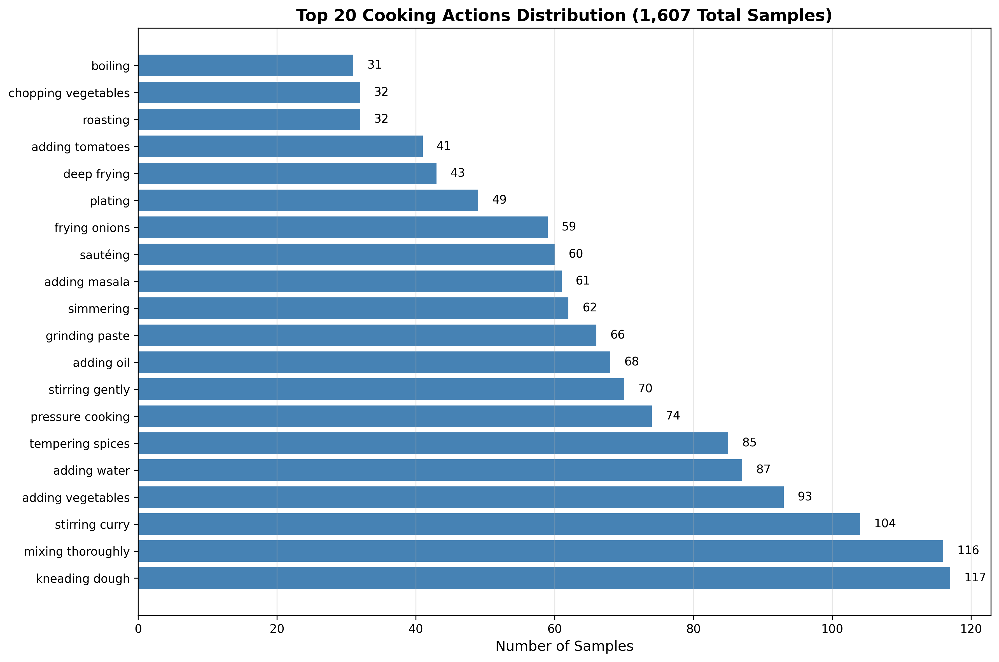
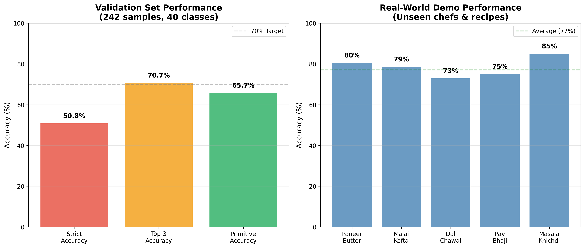

# Humanoid Cooking VLA
**Vision–Language–Action Learning for Humanoid Cooking Robots**

  

  <b>From real-world cooking videos → structured humanoid robot actions</b>

  
  
  
  

---

## Overview

This project introduces a **Vision-Language-Action (VLA)** system for humanoid cooking tasks.  
The model learns to translate **unstructured real-world cooking videos** into **discrete, executable robot actions**, enabling robust perception-to-action grounding.

---

## Results

  

- **77% accuracy** on real-world cooking videos  
- **90%+ precision** on high-frequency primitives  
- **1,607 labeled samples** spanning **40 action classes**

### Dataset & Model Insights

  
  

These results demonstrate improved action prediction consistency and robustness across diverse cooking scenarios.

---

## Architecture

YouTube Video
↓
Whisper (ASR) + CLIP (Vision)
↓
Vision-Language-Action Transformer
↓
Humanoid Robot Commands

The system integrates speech, vision, and temporal reasoning into a unified policy for long-horizon manipulation.

---

## Projects

### Project 1 — AI2-THOR Agent
Hybrid navigation + manipulation pipeline  
**~85–90% success rate** across kitchen environments

### Project 2 — VLA Transformer
19M-parameter multimodal sequence model  
Trained on real cooking demonstrations

### Project 3 — Continual Learning *(Planned)*
Incremental skill acquisition with long-term memory

---

## More

[LinkedIn Post](https://www.linkedin.com/posts/anshbhansali_robotics-embodiedai-vla-activity-7425027899964989440-44P2)

Contact: **anshbhansali5@gmail.com**
